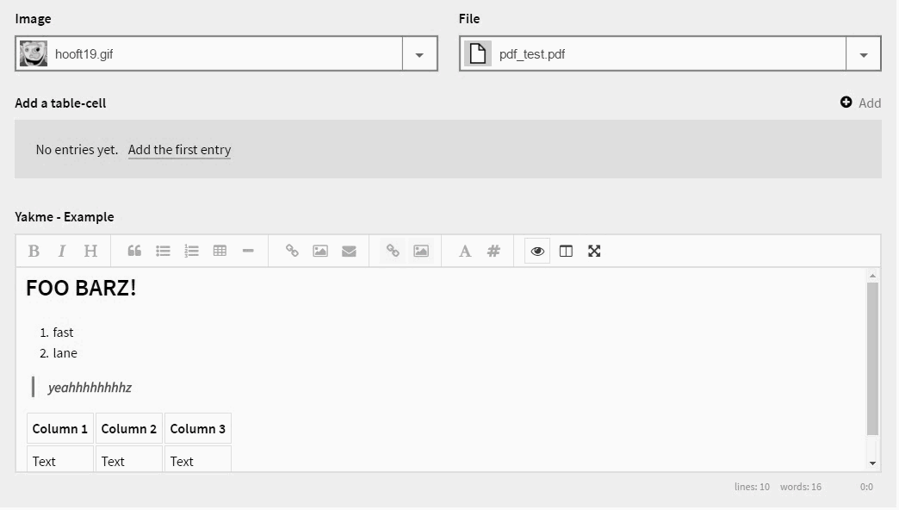

# [Kirby LISTER](https://github.com/1n3JgKl9pQ6cUMrW/kirby-lister)

#### Version 1.0.0 - 2016-07-16

- Initial Public Offering.

#### Version 1.1.5 - 2016-07-26

- Better styling.

#### Version 1.1.7 - 2017-02-25

- Bugfix where subpages were treated like media-files.
- Tested with Kirby 2.4

****

### What is it?

**[Kirby - LISTER](https://github.com/1n3JgKl9pQ6cUMrW/kirby-lister)** is a file-picker for the Kirby CMS, which supports a file preview (when available).

It uses the **excellent** jQuery plug-in of **http://www.selectboxit.com**

### Installation

- Download the .zip and extract it to the root of your site.
- Optionally you can configure some settings in `site/config/config.php`.

### Config

By default, no `config` is needed. But you can set your text / string preferences like the one below;

```
c::set('lister_loading', 'I am building the asset list, please wait...');
c::set('lister_select', 'You have to select a file first...');
c::set('lister_empty', 'No assets found on this page...');
```

### Usage

Kirby LISTER is a field, like the others.

```
#BLUEPRINT
  lister_example:
    label: Choose your file...
    type: lister
```

```
#TEMPLATE
<?php echo $page->file($page->lister_example())->url(); ?>
```

****



*Kirby LISTER - a file picker with a (pre-) view*